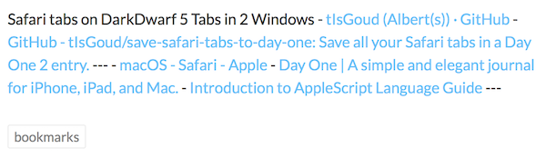
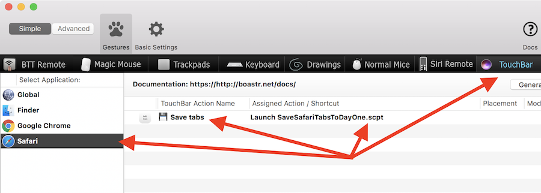
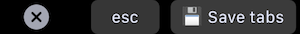

# Save Safari tabs to Day One

This AppleScript saves all tabs/URLs from all the Safari windows to a new entry in Day One 2.

The entry contains the tab names and URLs as clickable links.  
URLs are grouped per browser window and seperated by a horizontal rule.   
A "bookmarks" tag is added, the number of tabs and windows is displayed just below the title and in the title the name of the computer is used to identfy from which computer this entry originated.

By default the entry is created in the journal "🌐Bookmarks", and yes I use emoticons in my journal names. You can change the name of the journal to your liking but the journal will not be created for you. Make sure it exists before running the script.   

After the initial creation of the entry it looks a bit weird. See below.

I was unable to fix this programmatically but it is simply resolved by clicking on "Edit"  and "Done", Day One picks it up from there and the result looks like the previous image.

Next steps:

- Download the zip file or clone this repository.
- Open Script Editor and change the value of the variable  "destinationJournal" to match your situation. The script does not create the journal for you so make sure it exists.  
- Run it from the Script Editor to test the script in your environment.

Once you made sure it works on your system you can:

- Use the included Automator workflow to create a Service.
	- Change the path to where you saved the script
	- Copy the workflow to the Library > Services folder in your Home directory.
	- More information: [Use Automator to create a System-Wide service](https://developer.apple.com/library/content/documentation/LanguagesUtilities/Conceptual/MacAutomationScriptingGuide/MakeaSystem-WideService.html)
- Use [BetterTouchTool](https://www.boastr.net) to set up a keybinding.
- Use [BetterTouchTool](https://www.boastr.net) to create a Touch Bar button.

BetterTouchTool configuration:

The resulting Touch Bar button:

